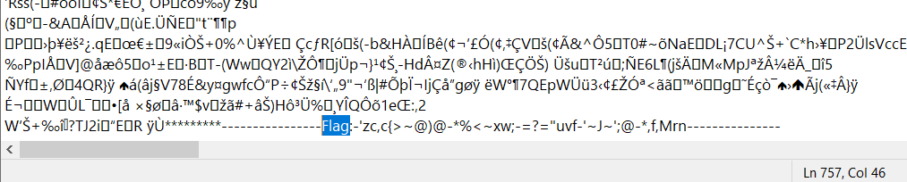

# Write - Up 18825

ข้อนี้จะมีไฟล์ 18825.jpg มาซึ่งในภาพจะไม่ได้มีอะไรพิเศษ แล้วมันอยู่ในไหนล่ะ

## Hex Demp

ถ้า Flag ไม่ได้อยู่ในภาพ ก็หมายความว่ามันอยู่ที่อื่น

ถ้าเราลองเปิดภาพด้วยโปรแกรม **Notepad** หรือ **Hex Editor** แล้วลองค้นหาคำว่า **Flag** จะเจอข้อความอยู่ด้านล่าง

