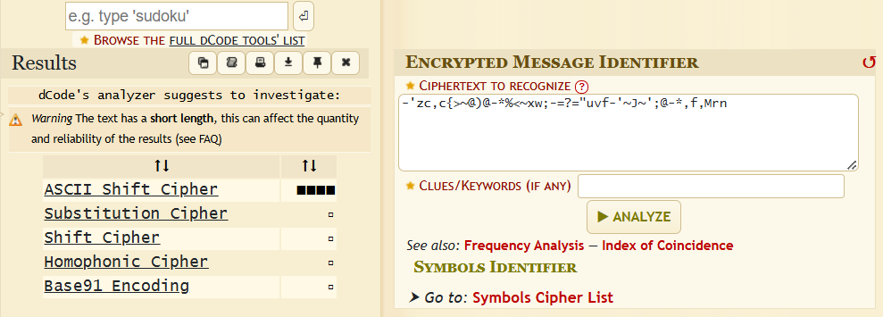
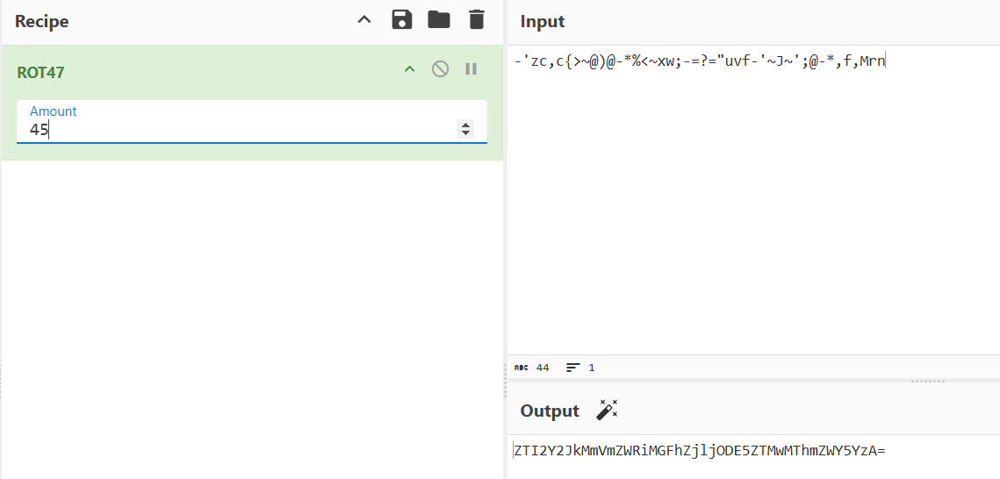
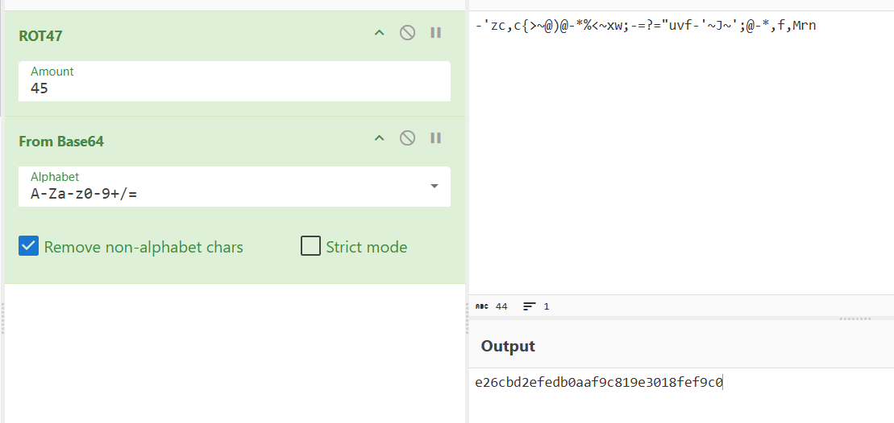

# Write - Up 18825

ข้อนี้จะมีไฟล์ 18825.jpg มาซึ่งในภาพจะไม่ได้มีอะไรพิเศษ แล้วมันอยู่ในไหนล่ะ

## Hex Demp

ถ้า Flag ไม่ได้อยู่ในภาพ ก็หมายความว่ามันอยู่ที่อื่น

ถ้าเราลองเปิดภาพด้วยโปรแกรม **Notepad** หรือ **Hex Editor** แล้วลองค้นหาคำว่า **Flag** จะเจอข้อความอยู่ด้านล่าง

เมื่อเราทำการตรวจสอบด้วย [Cipher-Identifier](https://www.dcode.fr/cipher-identifier) จะพบว่าเป็นการเข้ารหัสด้วย **ASCII Shift Cipher**

ให้ใช้ **ROT47 (ASCII Shift Cipher)** เพื่อถอดรหัส

จากนั้น **Decode** ด้วย **Base64**

จะได้ **Flag** ออกมาเป็น **md5**

### SKR-CTF{e26cbd2efedb0aaf9c819e3018fef9c0}
