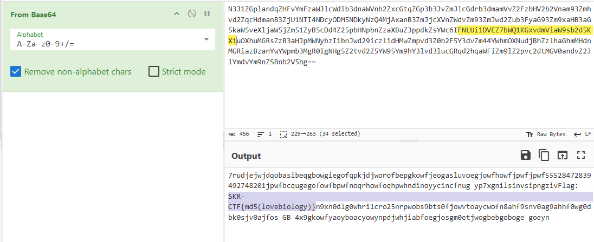

# Decrypt

วิธีแก้คือให้ทำการ **decrypt cipher text** จาก ไฟล์ **enc.txt** โดยย้อนกระบวนการจากฟังก์ชัน **base_pair** และ **encrypt** ตามลำดับ


> N3J1ZGplandqZHFvYmFzaWJlcWdib3dnaWVnb2ZxcGtqZGp3b3JvZmJlcGdrb3dmamVvZ2FzbHV2b2Vnam93Zmhvd2ZqcHdmanB3ZjU1NTI4NDcyODM5NDkyNzQ4MjAxanB3ZmJjcXVnZWdvZm93ZmJwd2Zub3FyaG93Zm9xaHB3aG5kaW5veXljaW5jZm51ZyB5cDd4Z25pbHNpbnZzaXBuZ3ppdkZsYWc6IFNLUi1DVEZ7bWQ1KGxvdmViaW9sb2d5KX1uOXhuMGRsZzB3aHJpMWNybzI1bnJwd29iczlidHMwZmpvd3Z0b2F5Y3dvZm44YWhmOXNudjBhZzlhaGhmMHdnMGRiazBzanYwYWpmb3MgR0IgNHg5Z2tvd2Z5YW95Ym9hY3lvd3lucGRqd2hqaWFiZm9lZ2pvc2dtMGV0andvZ2JlYmdvYm9nZSBnb2V5bg==

จากนั้นให้ทำการ **Decode** ด้วย **Base 64** จะได้ **Flag** ออกมา



นำคำว่า ```lovebiology``` ไป **Hash** จะได้ **Flag** ออกมา

### SKR-CTF{604775de914f01c34cee42f2221b2c19}
